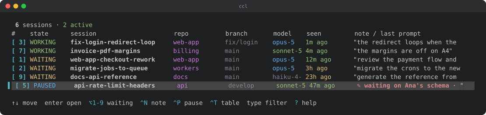

# claude-session-switcher

[](https://github.com/leonardo-bolanos/claude-session-switcher/actions/workflows/ci.yml)


[](LICENSE)

**Un panel para todas tus sesiones de Claude Code, y un atajo para saltar a la ventana de iTerm2
que tiene cada una.**

*[Read this in English](README.md)*

Si trabajas con varias sesiones de Claude Code abiertas a la vez —una por repo, varias por
repo— llega un punto en que no sabes cuál está en qué pestaña, ni cuál dejaste a medias.
`ccl` las lista todas con lo que estaban haciendo, y con `Enter` te lleva a su ventana.



Cada sesión muestra su rama, modelo, nivel de `effort` y el último prompt que le diste, para que
reconozcas en cuál estabas sin tener que entrar. El número de la izquierda es fijo: lo tecleas y
saltas.

```bash
ccl        # panel interactivo
ccl -w     # salta a la sesión que llevas más tiempo sin atender
```

## Por qué existe

Claude Code no tiene forma nativa de ver todas tus sesiones interactivas:

| Alternativa | Por qué no sirve |
|---|---|
| `claude agents` (panel oficial) | Solo muestra agentes en **background**. Tus sesiones de terminal no aparecen ahí |
| App de escritorio, sesiones paralelas | Existen, y están bien — pero solo ve las sesiones que abrió **ella**, en sus propios paneles |
| Gestores de sesiones (cmux, Clave, Claude Squad…) | Son dueños de las sesiones: las arrancas dentro de su terminal, su app o sus worktrees |
| Dashboard desde el móvil | Pedido en el issue [#35607](https://github.com/anthropics/claude-code/issues/35607), **cerrado como "not planned"** |

El patrón se repite: para que algo vea una sesión, tiene que haberla arrancado él. `ccl` va al
revés — encuentra las que arrancaste **tú**, donde las arrancaste, y mueve tu foco a la ventana
real de iTerm2. No te pide mudarte.

La única fuente que las ve todas es `claude agents --json`, que no tiene interfaz. `ccl` es esa
fuente, con interfaz y con el salto a la ventana correcta.

## Requisitos

- **macOS** y **iTerm2** — el salto de ventana usa AppleScript contra iTerm2. En Terminal.app el
  listado funciona, pero el salto no.
- **Python 3.7+** (por `datetime.fromisoformat`). Sin dependencias externas.
- **Claude Code** v2.1.139 o superior (cuando apareció `claude agents`).

## Instalación

```bash
brew install leonardo-bolanos/tap/ccl
```

O, como es un solo archivo y no tiene dependencias, descárgalo y dale permiso de ejecución:

```bash
mkdir -p ~/.local/bin
curl -fsSL -o ~/.local/bin/ccl https://raw.githubusercontent.com/leonardo-bolanos/claude-session-switcher/master/ccl
chmod +x ~/.local/bin/ccl
```

Luego asegúrate de que `~/.local/bin` está en tu `PATH`. Sin clonar, sin instalador, sin nada más
que instalar.

**No** es un `curl | sh`, y es a propósito: así puedes leer el archivo antes de darle permiso para
ejecutarse. Son ~2.000 líneas de Python y todos los subprocesos que lanza están a la vista.

<details>
<summary>Desde un clon — para contribuir, o para mantenerlo al día con <code>git pull</code></summary>

```bash
git clone https://github.com/leonardo-bolanos/claude-session-switcher.git
cd claude-session-switcher
./install.sh
```

El instalador crea un symlink en `~/.local/bin/ccl` y te imprime la función de shell que debes
añadir a tu `.zshrc` o `.bashrc`. **No modifica tu shell por su cuenta.** A mano es una línea:

```bash
ln -sf "$PWD/ccl" ~/.local/bin/ccl        # asegúrate de que ~/.local/bin está en tu PATH
```

</details>

## Uso

```bash
ccl              # panel interactivo
ccl --list       # listado estático de una pasada (útil en scripts)
ccl 7            # salta directo a la sesión número 7
ccl -w           # salta a la sesión que llevas más tiempo sin atender
ccl -w2          # ídem, la segunda de la cola de ESPERANDO
ccl --table      # una línea por sesión, en columnas
ccl --notify     # vigila en segundo plano y avisa cuando una pasa a esperarte
ccl --recent     # las que murieron con tu terminal — para reanudarlas
ccl --version    # imprime la versión
```

### Teclas del panel

| Tecla | Acción |
|---|---|
| `↑` `↓` | Mover selección |
| `PgUp` `PgDn` | Media página |
| `Enter` | Abrir esa sesión (enfoca su ventana y pestaña de iTerm) |
| `1` `2` … | Teclear el número de sesión; `⌫` corrige, `Enter` confirma |
| `⌥1` … `⌥9` | Saltar a la 1ª, 2ª … de **ESPERANDO**, sin confirmar |
| `Ctrl-N` | Escribir **tu propia nota** sobre esta sesión |
| `Ctrl-P` | **Pausar** esta sesión: espera a otro, no a ti |
| `Ctrl-T` | Cambiar a la **vista de tabla**: una línea por sesión, en columnas |
| clic | Seleccionar esa sesión |
| doble clic | Abrirla, igual que `Enter` |
| rueda | Mover la selección |
| cualquier letra | **Filtrar** por nombre, repo, rama, cuenta o nota |
| `Ctrl-R` | Forzar refresco |
| `?` | **Ayuda** con todos los atajos |
| `esc` | Limpia el filtro; si no hay filtro, sale |
| `q` | Salir (si no estás filtrando — con filtro activo es texto) |

La interfaz sigue **tu locale**: en español si tu `LANG` lo dice, y en inglés en caso contrario.
Se puede forzar con `CCL_LANG=es` / `CCL_LANG=en`.

El panel **se refresca solo** y **no se cierra al saltar**: vuelves a la lista con una
confirmación de a dónde fuiste.

### Dos vistas

`Ctrl-T` cambia la lista de dos líneas de arriba por **una línea por sesión, en columnas**, con el
estado como columna en vez de como cabecera de grupo — caben más o menos el doble en pantalla.
`ccl --table` arranca así.



`PAUSADAS` es una marca tuya (`Ctrl-P`) para las sesiones que esperan a otro: salen de la cola de
ESPERANDO, así que `⌥1`…`⌥9` y `ccl -w` se las saltan.

<details>
<summary><b>Ir a la que te está esperando</b> — incluido un atajo global</summary>

`-w` salta a la N-ésima sesión del grupo **ESPERANDO**, en el mismo orden en que las pinta el
panel (actividad más reciente primero). No necesita TTY ni abrir el panel, así que está pensado
para colgarlo de un **atajo global**. Con Hammerspoon:

```lua
-- ⌃⌘1 … ⌃⌘9 : salta a la 1ª, 2ª … sesión esperando, desde cualquier app
local ccl = os.getenv("HOME") .. "/.local/bin/ccl"
for n = 1, 9 do
  hs.hotkey.bind({ "ctrl", "cmd" }, tostring(n), function()
    if not hs.fs.attributes(ccl) then
      hs.alert.show("ccl no está en " .. ccl)
      return
    end
    hs.task.new(ccl, nil, { "-w" .. n }):start()
  end)
end
```

`⌃⌘` en vez de `⌘` a secas porque `⌘1..9` ya cambia de pestaña en iTerm2, en el navegador y en
media docena de apps más; robárselo a todas para esto no vale la pena.

**No hace falta envolverlo en un shell de login.** Un lanzador arranca el proceso con el PATH
mínimo de launchd (`/usr/bin:/bin:/usr/sbin:/sbin`), donde `claude` no está — con npm bajo nvm
vive en `~/.nvm/versions/node/<versión>/bin`, que además cambia al actualizar Node. `ccl` lo
busca por su cuenta en las ubicaciones habituales (ver `CLAUDE_EXTRA` en el script), así que
`hs.task` vale tal cual; `zsh -ic` costaba ~0,7 s por pulsación.

Dentro del panel, `⌥1` … `⌥9` hacen lo mismo. `⌥1..9` cuenta siempre sobre la **lista completa,
ignorando el filtro activo**: la tecla significa «sácame de aquí, a la que me espera», y si
contara sobre lo filtrado el mismo número llevaría a sesiones distintas según lo que tuvieras
escrito.

**Para que `⌥` llegue al programa** hay que poner **Left Option key: `Esc+`** en iTerm2
(Settings → Profiles → Keys). Sin eso, `⌥1` produce un símbolo (`¡`) y el panel lo trata como
texto de filtro. `⌘1..9` no puede usarse: iTerm2 se lo queda para cambiar de pestaña y nunca
llega a `ccl` — si lo prefieres, mapea `⌘N` → *Send Escape Sequence* `N` y funcionará igual, a
costa de perder el cambio de pestaña.

</details>

<details>
<summary><b>Cuando iTerm se cae</b> — recuperar las sesiones</summary>

Las sesiones de Claude Code mueren con su terminal. Así que cuando iTerm se va,
`claude agents --json` deja de verlas y `ccl` enseña un panel vacío **justo cuando más falta
hace** — medido en una caída real: 20 sesiones perdidas, y el registro devolviendo `[]` incluso
para los dos procesos que seguían vivos.

Pero la conversación está en disco, en `~/.claude/projects/`, y `claude --resume` la recupera.
`ccl --recent` lee esos transcripts y lista lo que se puede reanudar — repo, rama, modelo, tu nota
y el último prompt, para que puedas distinguirlas:

```
  RECUPERABLES (6)

[ 1] Verificar conexión USB del iPhone   movil-cari    hace 11h
     ✎ nuevo celu · develop · opus-5 · "…"
```

`Enter` abre una pestaña nueva de iTerm, entra en el directorio de la sesión y lanza
`claude --resume`. Una tecla por sesión. El resto del panel funciona igual: el filtro, la vista de
tabla y tus notas — que van por sessionId, así que sobreviven a que la sesión muera.

Dos cosas que conviene saber:

- **Funciona aunque `claude` no conteste.** Si el registro no responde, `ccl` asume que no hay
  nada corriendo y las lista todas. Fallar ahí sería fallar exactamente en el escenario para el
  que existe la función.
- **Las vivas se filtran con ese mismo registro**, así que si está desactualizado puede colarse
  una que sí está corriendo. Reanudarla abre una segunda pestaña sobre la misma conversación — el
  último prompt suele bastar para reconocer las que aún tienes abiertas.

Si prefieres no perderlas siquiera, lanza Claude Code dentro de tmux: las sesiones sobreviven al
terminal, y algún día `ccl` soportará tmux ([TODO.md](TODO.md)).

</details>

<details>
<summary><b>Que te avisen, en vez de mirar</b> — notificaciones en segundo plano</summary>

`ccl --notify` no pinta nada. Se queda de fondo y manda una notificación de macOS cuando una
sesión **pasa** a esperarte:

```bash
ccl --notify        # cada 15s
ccl --notify 60     # o más lento
```

Avisa del **flanco, no del estado**: de las que acaban de pasar de trabajar a esperar. Dos
consecuencias que importan más de lo que parecen:

- **La primera foto solo se memoriza.** Arrancar el vigilante con doce sesiones ociosas manda
  cero avisos — la forma más rápida de que alguien apague las notificaciones para siempre es
  soltarle doce de golpe.
- **Las pausadas no avisan nunca.** Ya dijiste que esa espera a otro.

Más de tres a la vez se juntan en un solo aviso resumido, por lo mismo.

Combínalo con `-w` en un atajo global y no abres el panel nunca: te avisa, y `⌃⌘1` te lleva. Para
arrancarlo al iniciar sesión, en `~/Library/LaunchAgents/com.ccl.notify.plist`:

```xml
<key>ProgramArguments</key>
<array>
  <string>/Users/tu-usuario/.local/bin/ccl</string>
  <string>--notify</string>
</array>
<key>RunAtLoad</key><true/>
<key>KeepAlive</key><true/>
```

Una verruga que conviene saber: los avisos salen por `osascript`, así que macOS se los atribuye a
**Script Editor** — ese es el icono que verás, y es a Script Editor a quien hay que permitirle
notificar en Ajustes del Sistema → Notificaciones. Hacerlo mejor exige empaquetar una app
firmada, que es mucha maquinaria para una línea de AppleScript.

</details>

<details>
<summary><b>Tu propia nota en una sesión</b></summary>

`Ctrl-N` escribe una nota sobre la sesión seleccionada — un nombre que signifique algo para *ti*,
cuando `web-app` no dice lo suficiente:

```
[ 1] web-app-checkout-rework   web-app   hace 12m
     ✎ backend de facturación · main · opus-5 · "revisa el flujo de pago…"
```

`Enter` guarda, una nota vacía la borra, `esc` cancela. `Ctrl-N` arranca con el texto que ya
hubiera, así que corregir no es reescribir. **También se busca por ella al filtrar**, que es media
razón para escribirla: etiquetas como "facturación" un repo que se llama `web-app` y lo encuentras
por esa palabra.

Las notas son **por sesión**, con la del repo como respaldo: una sesión sin nota propia muestra la
de su directorio. Hacen falta las dos porque son dos usos distintos — *«esperando que Felipe haga
algo»* es el estado de UNA conversación, mientras que *«backend de facturación»* describe el repo y
vale para todas sus sesiones (y sobrevive a reiniciar Claude Code, que cambia el `sessionId`).

Se guarda en `~/.claude/ccl-notes.json`:

```json
{
  "por_sesion": { "<sessionId>": "esperando que Felipe haga algo" },
  "por_repo":   { "/Users/tu/code/api": "backend de facturación" }
}
```

`Ctrl-N` escribe la de la sesión; borrarla hace reaparecer la del repo. Las de repo se editan a
mano en ese archivo — es JSON plano a propósito. El formato anterior (un `{ruta: nota}` plano) se
sigue leyendo como notas de repo, así que nada de lo escrito antes se pierde.

No se purga nada: ni las sesiones muertas ni los directorios que ya no existen. Un disco externo
desmontado o un repo movido de sitio borraría en silencio algo que escribiste a mano, y el archivo
son unos pocos KB aunque acumule.

</details>

<details>
<summary><b>PAUSADAS: las que esperan a otro, no a ti</b></summary>

Una sesión parada porque espera la respuesta de un compañero, un despliegue o una revisión se ve
exactamente igual que una que te espera a *ti*: Claude Code solo dice `busy` o `idle`. Así que
`Ctrl-P` es **una marca tuya**.

Las pausadas van a su propio grupo, debajo de ESPERANDO, y —esto es lo que importa— **salen de la
cola de ESPERANDO**: `⌥1`…`⌥9` y `ccl -w` se las saltan, así que el atajo no puede mandarte justo
a la única que no puedes desatascar. `Ctrl-P` otra vez la devuelve.

Combínalo con una nota que diga *qué* estás esperando:

```
  PAUSADAS (2)

[ 4] api-invoice-rework        api       hace 2h
     ✎ esperando el esquema de Felipe · main · opus-5 · "…"
```

Si una pausada vuelve a trabajar aparece en TRABAJANDO, no aquí abajo: si está corriendo, no
espera a nadie.

Se guarda junto a las notas, en `~/.claude/ccl-notes.json` bajo `pausadas`, como una lista de
sessionId. Tampoco se purga nada: un sessionId es un UUID y no vuelve, así que una entrada
huérfana no puede pausar a nadie por error.

</details>

<details>
<summary><b>Vista de tabla</b>, y qué columnas caen en una ventana estrecha</summary>

Todo lo que hace el panel sigue funcionando en la tabla: el cursor se queda en la misma sesión al
cambiar de vista, el clic elige la fila que pulsaste, y al filtrar se mantiene la cabecera de
columnas.

En una ventana estrecha desaparecen las columnas prescindibles (primero la rama, luego el modelo)
en vez de recortarlas todas hasta hacerlas ilegibles; lo que sobra se lo queda la nota.
`ccl --list --table` imprime lo mismo sin panel y sin colores, así que se puede pasar por una
tubería.

</details>

<details>
<summary><b>Ratón, y cómo seleccionar texto para copiar</b></summary>

Clic selecciona, **doble clic abre**, la rueda mueve la selección. El doble clic no lo reporta el
terminal — solo llegan clics sueltos — así que se sintetiza midiendo el tiempo entre dos clics en
la misma fila (400 ms).

Mientras el panel está abierto **los clics son suyos**, así que arrastrar no selecciona texto.
Tres vías, de la más rápida a la más cómoda:

| Cómo | Cuándo |
|---|---|
| `⌥` + arrastrar, luego `⌘C` | Copiar algo suelto sin salir del panel |
| `CCL_MOUSE=0 ccl` | Vas a copiar mucho: arranca sin ratón y la selección es la normal |
| `ccl --list` | Lo más cómodo: sin panel, y queda en pantalla. `ccl --list \| pbcopy` copia todo |

`⌥` funciona porque iTerm2 no le pasa el evento al programa cuando ese modificador está pulsado.
Y ojo con el panel: usa la pantalla alternativa, así que **al salir se restaura lo que había y se
lleva la lista** — si quieres copiar de ahí, hazlo antes de salir. Por eso `--list` suele ser
mejor idea: escribe en la pantalla normal y se queda en el scrollback.

Como `--list` detecta que no escribe a un terminal, la salida por tubería va **sin códigos de
color**, lista para pegar.

</details>

<details>
<summary><b>Filtrar</b></summary>

Con muchas sesiones, escribe para reducir la lista: `supp` deja solo las de `support-agent`.
Ignora mayúsculas y acentos (`migracion` encuentra `migración`), y varios términos se combinan
sin importar el orden: `api backend` casa igual que `backend api`.

Mientras filtras, los dígitos forman parte del texto (para buscar `v5` o `0042`); con el filtro
vacío vuelven a ser selección de número.

En ventanas pequeñas la cabecera del grupo queda **fija arriba** al hacer scroll, para que no
pierdas de vista si estás en TRABAJANDO o en ESPERANDO.

</details>

<details>
<summary><b>Varias cuentas de Claude Code</b></summary>

Detecta sola `~/.claude` y cualquier `~/.claude-<algo>` que tenga un `projects/` dentro, así que
las sesiones de una segunda cuenta aparecen sin configurar nada. Cuando hay más de una, se añade
una columna con el nombre de la cuenta.

Para fijar la lista a mano:

```bash
export CCL_CONFIG_DIRS=~/.claude:~/.claude-trabajo
```

</details>

<details>
<summary><b>Numeración estable y colores</b></summary>

El número de cada sesión se guarda en `~/.claude/ccl-numbers.json` y **no cambia entre
ejecuciones**, aunque la lista se reordene por actividad. Puedes memorizar "el 7 es el backend".
Cuando una sesión muere, su número se libera y se recicla.

| Elemento | Significado |
|---|---|
| Nota `✎` | salmón apagado en negrita — es lo único de esa línea que escribiste tú |
| Antigüedad | verde reciente → amarillo → gris viejo |
| Modelo | azul Opus · verde Sonnet · gris Haiku · magenta Fable |
| `effort` | amarillo solo en `xhigh` / `max` |
| ⚠ rojo | La sesión no está en una ventana de iTerm |
| fila seleccionada | barra `▌` cian y una banda gris oscura en toda la fila |

La banda es un fondo de la paleta de 256, que se lee bien en un tema oscuro y mal en uno claro.
`CCL_CURSOR_BG=236 ccl` cambia el color (un índice de xterm-256) y `CCL_CURSOR_BG=0 ccl` lo apaga
— la barra `▌` se queda en los dos casos, así que la selección nunca queda en duda.

</details>

<details>
<summary><b>Cómo funciona</b>, y dos trampas de rendimiento</summary>

1. **Origen de datos**: `claude agents --cwd ~ --json` da PID, cwd, nombre y estado de cada
   sesión viva.
2. **PID → ventana de iTerm**: `ps -o tty=` da el TTY de cada proceso, y un AppleScript devuelve
   el par ventana/pestaña de iTerm2 para cada TTY.
3. **Contexto de cada sesión**: se leen **solo los últimos 64 KB** del transcript
   (`~/.claude/projects/*/<sessionId>.jsonl`) para sacar la última actividad, la rama, el modelo,
   el effort y el último prompt. Es imprescindible: esos archivos llegan a superar los 100 MB y
   leerlos enteros haría el comando inusable.
4. **Refresco**: en un hilo aparte, cada 4 s mientras interactúas, relajándose a 20 s tras dos
   minutos sin teclear. En reposo el panel consume 0 % de CPU.

Un par de detalles que costaron encontrar:

- El AppleScript **no** recorre sesión por sesión. Resolver la ruta completa
  (`tty of session s of tab t of window w`) cuesta una llamada IPC por propiedad y tardaba 2,2 s
  con 44 pestañas. Con dos consultas masivas y reconstrucción en Python baja a ~0,5 s.
- **El `mtime` del transcript no sirve** como "última actividad": se escribe en bloque y varias
  sesiones acaban con la misma marca. Hay que usar el último campo `timestamp` de dentro del
  archivo.

</details>

## Tests

```bash
python3 test_ccl.py         # lógica pura — rápido (~2 s)
python3 test_panel.py       # el panel de verdad, sobre un pty (~3 min)
```

Sin dependencias, y **ninguno de los dos toca iTerm ni lanza `claude`**.

`test_ccl.py` cubre la lógica pura: helpers de ancho, numeración estable, parseo de la salida de
AppleScript, lectura de transcripts, agrupación y orden, la pausa, el filtro, multi-cuenta, las
columnas de las dos vistas, el listado estático, la pantalla de ayuda, la decodificación de
teclas y ratón, y el manejo de errores.

`test_panel.py` arranca **el panel entero en un pty** y comprueba lo que solo se ve corriéndolo:
que las flechas y la rueda muevan el cursor donde deben, que un clic caiga en la fila correcta en
las dos vistas, que el doble clic abra y dos clics lentos no, que el editor de notas se quede el
teclado —un `Ctrl-P` en medio de la frase no puede pausar nada a tus espaldas—, que la ayuda
pagine y que `--list` salga sin colores. Es hermético porque sustituye la lista de sesiones por datos sintéticos y deja el mapa de
iTerm vacío: **el salto falla con elegancia y no le roba el foco a nadie**.

Uno de ellos es un guardarraíl de diseño: comprueba que **ninguna acción cuelgue de una letra
suelta**, porque cualquier letra empieza a filtrar. Ya pasó dos veces (`r` impedía buscar
"revisa").

El CI corre las dos suites en Linux (Python 3.9/3.11/3.13) y en macOS, donde además comprueba que
el script degrada con un error claro cuando Claude Code no está instalado.

<details>
<summary>Regenerar el demo</summary>

```bash
python3 make_demo.py            # la animación de arriba
python3 make_demo.py --table    # la imagen fija de la vista de tabla
```

Graba el programa de verdad en un pty con sesiones sintéticas y escribe `demo.svg` / `table.svg`.
Sin dependencias, sin paso de grabación manual, y no expone ninguno de tus repos ni prompts reales.

</details>

## Limitaciones conocidas

- **Formato interno no documentado**: `aiTitle` y `lastPrompt` vienen del transcript de Claude
  Code, que Anthropic no documenta y puede cambiar en cualquier versión. Se tratan como
  opcionales — si desaparecen, el panel sigue funcionando sin esa información.
- **Los índices de pestaña se desplazan** si cierras una pestaña de la misma ventana entre listar
  y elegir. El riesgo es de segundos y el peor caso es enfocar la pestaña vecina.
- **Solo iTerm2** para el salto de ventana. El listado funciona en cualquier terminal.
  Terminal.app sí sería viable (expone `tty` por AppleScript) y tmux también; ver
  [TODO.md](TODO.md).
- **Solo macOS.** En Windows el script ni arranca: el panel usa `termios`/`tty`, que no existen
  ahí. Portarlo es un trabajo real, no un ajuste — está desglosado en [TODO.md](TODO.md).

## Qué falta

Terminal.app, Windows, otras terminales y algunos detalles menores, con lo ya investigado de cada
uno: [TODO.md](TODO.md) (en inglés, como el resto de lo que mira quien vaya a contribuir).

## Licencia

MIT — ver [LICENSE](LICENSE).
